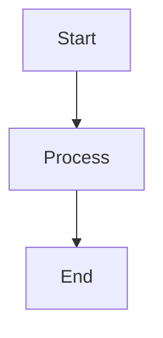

# GitBook.com Integration Guide

This guide explains how to sync the DI Network documentation with GitBook.com using GitHub integration.

## Setup Steps

### 1. Create GitBook Account
1. Go to [GitBook.com](https://www.gitbook.com)
2. Sign up or log in with your GitHub account
3. Create a new organization for "DI Network"

### 2. Create New Space
1. Click "New Space" in GitBook dashboard
2. Choose "Import from Git"
3. Select your GitHub repository containing DI-Docs
4. Choose the main branch
5. Set root path to `/DI-Docs` if needed

### 3. Configure GitHub Sync
1. In GitBook space settings, go to "Integrations"
2. Enable "GitHub Sync"
3. Configure sync settings:
   - **Branch**: `main` or `master`
   - **Root Path**: `/DI-Docs`
   - **Auto-sync**: Enable for automatic updates

### 4. Repository Structure
Ensure your GitHub repository has this structure:
```
your-repo/
├── DI-Docs/
│   ├── README.md
│   ├── SUMMARY.md
│   ├── book.json
│   ├── package.json
│   ├── styles/
│   ├── introduction/
│   ├── dassets/
│   └── ...other folders
```

### 5. GitBook Configuration
The `book.json` file is configured for GitBook.com with:
- Mermaid diagrams support
- Search functionality
- Custom styling
- Social sharing

### 6. Custom Domain (Optional)
1. In GitBook space settings, go to "Domain"
2. Add custom domain: `docs.dinetwork.org`
3. Configure DNS records as instructed
4. Enable SSL certificate

## Sync Workflow

### Automatic Sync
- Changes pushed to GitHub automatically sync to GitBook
- Usually takes 1-2 minutes to reflect changes
- GitBook builds and deploys automatically

### Manual Sync
1. Go to GitBook space settings
2. Click "Integrations" → "GitHub Sync"
3. Click "Sync now" button

## Content Guidelines

### Mermaid Diagrams
Use mermaid code blocks for diagrams:
```markdown

```

### File Organization
- Keep all documentation in `/DI-Docs` folder
- Use relative links between pages
- Follow the SUMMARY.md structure
- Use descriptive file names

### Images and Assets
- Store images in appropriate folders
- Use relative paths: `./images/diagram.png`
- Optimize images for web (< 1MB)

## GitBook Features

### Available Features
- ✅ Mermaid diagrams
- ✅ Search functionality
- ✅ Custom styling
- ✅ Social sharing
- ✅ PDF export
- ✅ Mobile responsive
- ✅ Analytics
- ✅ Comments and discussions

### GitBook.com Benefits
- Professional hosting
- Fast global CDN
- SEO optimization
- Analytics dashboard
- Team collaboration
- Version control
- Custom domains

## Troubleshooting

### Sync Issues
1. Check GitHub webhook is active
2. Verify repository permissions
3. Check for syntax errors in markdown
4. Review GitBook sync logs

### Mermaid Not Rendering
1. Ensure `mermaid-gb3` plugin is installed
2. Check mermaid syntax is correct
3. Verify code block language is set to `mermaid`

### Styling Issues
1. Check `styles/website.css` is present
2. Verify CSS syntax is correct
3. Clear GitBook cache and re-sync

## Support

- **GitBook Support**: [GitBook Help Center](https://docs.gitbook.com)
- **GitHub Integration**: [GitHub Sync Documentation](https://docs.gitbook.com/integrations/github)
- **Mermaid Plugin**: [Mermaid GitBook Plugin](https://github.com/JozoVilcek/gitbook-plugin-mermaid-gb3)

---

**Next Steps**: 
1. Push this repository to GitHub
2. Follow the setup steps above
3. Your documentation will be live at `https://your-org.gitbook.io/di-network/`